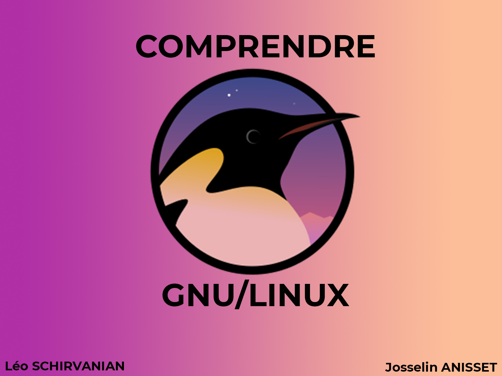



# Linux Kernel : Histoire, Architecture & Analyse de code

## Préface

Un système d'exploitation (ou OS : Operating System en anglais) est un ensemble de logiciel permettant de gérer les différentes ressources d'un ordinateur. En outre c'est le système d'exploitation de votre ordinateur qui vous permet d'ouvrir des applications tels que Google Chrome, Firefox, Outlook, ... En effet, au lieu de demander à chaque application de gérer les ressources matérielles (hardware en anglais) de ces futurs utilisateurs; l'OS centralise toutes les demandes et allocutions concernant ces ressources matérielles de l'ordinateur. Ainsi au lieu d'avoir des comportements anarchiques avec des logicielles qui se battent sans merci pour avoir un peu de RAM, d'espace de stockage ou accès à un SSD plutôt qu'un disque dur, c'est l'OS qui va agir comme gardien des ressources matérielles de l'ordinateur.

Prenons un exemple concret, vous êtes sur votre bureau et vous souhaitez ouvrir Google Chrome afin d'aller explorer internet et son web. Vous allez alors lancer Google Chrome et ce dernier va normalement s'ouvrir sans trop de soucis. Or, cette tâche tout à fait anodine a en fait demandé la sollicitation de l'OS puisque rappeler vous, c'est ce dernier et uniquement ce dernier qui détient l'accès et gère les ressources matérielles de votre ordinateur. Ainsi, lorsque vous lancez Google Chrome (ou tout autre logiciel, programme, script, ...) sur votre ordinateur, ce dernier va alors demander à l'OS s'il a la possibilité de s'ouvrir, c'est à dire s'il reste de la place sur la RAM par exemple pour stocker et afficher les pages webs. Si oui, alors Google Chrome s'ouvre et à vous les joies d'internet. Sinon, Google Chrome plante et rien ne se passera.

L'idée générale à retenir d'un OS, c'est qu'aucun logiciel ne doit accéder aux ressources matérielles sans l'accord et le contrôle de ce premier. Car dans le cas contraire, ce serait l'anarchie sur votre ordinateur et chaque programme tentera de prendre le plus de ressources possibles et au final aucun de ces programmes ne marchera. Il vaut donc mieux laisser un système d'exploitation faire le travail d'accès et de gestion du matériels pour tous les logiciels où ces derniers puissent cohabiter, plutôt que l'inverse.

Nous pouvons donc résumer le travail d'un système d'exploitation avec ce schéma ci-dessous :

  

## Commençons 

Nous savons maintenant expliquer à quoi sert, de base, un système d'exploitation. 
