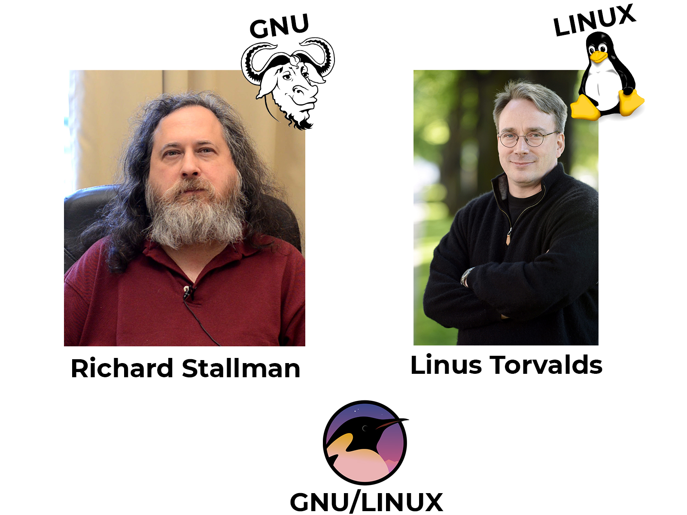



# Linux Kernel : Histoire, Architecture & Analyse de code

## Préface

Un système d'exploitation (ou OS : Operating System en anglais) est un ensemble de logiciel permettant de gérer les différentes ressources d'un ordinateur. En outre c'est le système d'exploitation de votre ordinateur qui vous permet d'ouvrir des applications tels que Google Chrome, Firefox, Outlook, ... En effet, au lieu de demander à chaque application de gérer les ressources matérielles (hardware en anglais) de ces futurs utilisateurs; l'OS centralise toutes les demandes et allocutions concernant ces ressources matérielles de l'ordinateur. Ainsi au lieu d'avoir des comportements anarchiques avec des logicielles qui se battent sans merci pour avoir un peu de RAM, d'espace de stockage ou accès à un SSD plutôt qu'un disque dur, c'est l'OS qui va agir comme gardien des ressources matérielles de l'ordinateur.

Prenons un exemple concret, vous êtes sur votre bureau et vous souhaitez ouvrir Google Chrome afin d'aller explorer internet et son web. Vous allez alors lancer Google Chrome et ce dernier va normalement s'ouvrir sans trop de soucis. Or, cette tâche tout à fait anodine a en fait demandé la sollicitation de l'OS puisque rappeler vous, c'est ce dernier et uniquement ce dernier qui détient l'accès et gère les ressources matérielles de votre ordinateur. Ainsi, lorsque vous lancez Google Chrome (ou tout autre logiciel, programme, script, ...) sur votre ordinateur, ce dernier va alors demander à l'OS s'il a la possibilité de s'ouvrir, c'est à dire s'il reste de la place sur la RAM par exemple pour stocker et afficher les pages webs. Si oui, alors Google Chrome s'ouvre et à vous les joies d'internet. Sinon, Google Chrome plante et rien ne se passera.

L'idée générale à retenir d'un OS, c'est qu'aucun logiciel ne doit accéder aux ressources matérielles sans l'accord et le contrôle de ce premier. Car dans le cas contraire, ce serait l'anarchie sur votre ordinateur et chaque programme tentera de prendre le plus de ressources possibles et au final aucun de ces programmes ne marchera. Il vaut donc mieux laisser un système d'exploitation faire le travail d'accès et de gestion du matériels pour tous les logiciels où ces derniers puissent cohabiter, plutôt que l'inverse.

Nous pouvons donc résumer le travail d'un système d'exploitation avec ce schéma ci-dessous :

  

Nous savons maintenant expliquer à quoi sert, de base, un système d'exploitation. Chaque système d'exploitation est unique et ne propose pas les mêmes services que ces pairs donc il est plutôt hardu de définir exhaustivement tous les services que propose tous les OS, mais dorénavant vous avez l'essentiel.

## Introduction

Au vu de la complexité que représente un système d'exploitation, il est évidemment impossible de lister exhaustivement toute l'architecture et d'analyser tout le code de Linux dans une présentation concise et si possible intéressante. Dans ce rapport, nous ne ferons donc qu'aller à l'essentiel sur de nombreux points surtout au niveau de l'architecture qui est plutôt assez impressionante et rebutante quand on s'y plonge dedans. En ce qui concerne l'analyse du code, nous n'allons évidemment pas commenter chaque ligne de code du noyau Linux, nous prendrons un module comme exemple de tout le projet Linux avec des défauts et des avantages caractéristiques de tout le kernel.

Il est bon de préciser aussi, que ce rapport ne fait aucunement la promotion d'un système d'exploitation en dépit d'un autre. Chaque OS a ces avantages et ces inconvénients et répondent à différentes problématiques spécifiques. Nous ne ferons qu'ici un rapport expliquant et détaillant les forces et les faiblesses du noyau Linux.

Mais avant de commencer réellement et de se lancer dans le grand bain, il est important de savoir dans quoi nous allons plonger.

## Historique

Si vous avez bien compris la préface, vous avez compris qu'un ordinateur ne peut fonctionner sans OS, donc logiquement depuis que les ordinateurs existent (cc Alan Turing) il y a toujours un ensemble d'algorithme qui s'apparante aujourd'hui à un système d'exploitation. 

Avant Linux, il y avait deux principaux système d'exploitation qui régnait sur le monde de l'informatique :
- MS-DOS : système d'exploitation propriétaire et payant de Microsoft 
- Unix : système d'exploitation propriétaire et payant aussi de AT&T (considéré comme plus performant que son concurrent mais plus dur à prendre en main)

A cette époque, pas d'interface graphique, faute de mémoire vive, mais les ordinateurs fonctionnaient de la même façon qu'aujourd'hui. Seul problème, vous l'avez peut être remarqué, les deux principaux systèmes d'exploitation sont propriétaires et payants ce qui est plutôt contraignants quand on est feru d'informatique : payer une licence 200-300€ à chaque fois que l'on souhaite monter un ordinateur c'est plutôt contraignant quand on souhaite se mettre à un niveau avancé en informatique.

C'est alors que deux projets vont voir le jour en même temps pour développer un nouveau système d'exploitation totalement gratuit et surtout libre. Un logiciel libre signifie qu'en plus d'être gratuit, le code source est consultable par les utilisateurs (open source en anglais) ce qui donne la possibilité de le modifier selon leur bon vouloir et même de le redistribuer pour en faire leur propre version et même la "commercialiser" :
- D'un côté le projet GNU de Richard Stallman qui souhaitait créer un système d'exploitation gratuit basé sur Unix
- De l'autre un étudiant, Linus Torvald, de l'Université de Helsinki (Finlande), entreprend de créer sur son temps libre son propre système d'exploitation : Linux (contraction de Linus et Unix)

Il s'avère que les projets se développent à peu près en même temps mais surtout qu'ils sont complémentaires. D'un côté tandis que Richard Stallman créait les programmes de base (programme de copie de fichier, de suppression de fichier, éditeur de texte), Linus s'était lancé dans la création du « cœur » d'un système d'exploitation : le noyau. Le projet GNU (programmes libres) et Linux (noyau d'OS) ont fusionné pour créer GNU/Linux.

  

Vous l'avez peut être déjà compris mais le fait que le projet GNU/LINUX est gratuit et libre constitue un avantage indéniable sur les autres systèmes d'exploitation. De plus, comme on peut le redistribuer, de nombreuses entreprises se sont créées sur la redistribution de ce projet et propose ce qu'on appelle des distributions. En effet, un système d'exploitation est en lui-seul peu utile, il nous faut des logiciels pour le rendre utile et qu'il travaille un peu : un environnement de bureau (Gnome, XFCE, ...), des services de messageries, des gestionnaire de fichiers (Nautilus,...), des terminaux de commandes (Konsole, ..), des gestionnaires de paquets (apt-get, pacman, ...), ...

Il existe donc de multiples distributions et théoriquement une infinité vu que n'importe quelle installation avec un noyau linux et une distribution. On peut citer les plus connues : Ubuntu, Debian, Mint, Arch, Kali, Mandriva, Red Hat, ...

Il serait complétement incensé de lister exhaustivement tous les avantages et défauts, architectures, codes des différentes distributions. Nous allons évidemment nous concentrer sur le noyau linux. Néanmoins le noyau Linux est intrinsèquement un projet qui évolue perpetuellement. Il est donc délicat de parler de son architecture et de son code comme quelque chose de définitif. Pour preuve, il suffit d'aller voir le projet Linux disponible sur GitHub (Linus Torvalds est entre autre le créateur du logiciel de gestions de version : Git)

  
  
 Source : https://github.com/torvalds/linux 

Comme vous pouvez le voir, c'est l'un des projets les plus suivis et mis à jour de la plateforme GitHub (presque 1 million de commits ! Le nombre de contributeurs indiquent le symbole infini ∞ ! Des dizaines de milliers de fork et de stars , ...) c'est un projet absolument colosal. Voilà ce qu'est Linux aujourd'hui !

## Commençons 

Mais par où commencer, sous quel angle attaquer ce projet conséquent qui est mis à jour et améliorer presque tous les jours par des milliers de contributeurs à travers le monde ? Et bien en analysant l'essentiel de ce projet, sa racine, son tronc, son architecture. Nous allons nous attarder sur ce qui fait que Linux est si "facilement" modifiable, améliorable et maintenable et pourquoi il a la popularité qu'il détient aujourd'hui.

Malheureusement (ou heureusement), le noyau Linux n'est pas orienté objet : exit donc le diagramme UML de classe pour nous aider à comprendre comment il est construit. Nous ne pourrons donc pas utiliser le langage UML pour décrire ce projet mais on peut toujours essayer de le schématiser. Cependant schématiser un si gros projet, reviendrait à le comprendre entièrement et effectuer un travail conséquent pour réduire son explication en quelques pages. Or il existe déjà des livres qui tentent dans le faire de manière plus ou moins concise (Pour info, ce livre fait presque 1000 pages) :

  
  
 Source : https://www.amazon.com/Understanding-Linux-Kernel-Process-Management-ebook-dp-B0043D2E54/dp/B0043D2E54/ref=mt_kindle?_encoding=UTF8&me=&qid= 

Tout ce qui a été dis précédemment ne sers qu'à souligner le fait que nous allons forcément faire d'énormes raccourcis dans l'explication de l'architecture et du code du noyau Linux. Nous se serons absolument pas exhaustif et très précis dans notre explication. Si vous souhaitez en apprendre plus sur le noyau Linux, il existe de multiples livres (payants bien sûr) qui feront de vous des experts du système d'exploitation, mais évidemment cela s'adresse aux personnes souhaitant en faire leur métier ou très passionné par le sujet, à vous de voir.
