

# Linux Kernel : Histoire, Architecture & Analyse de code

## Préface

Un système d'exploitation (ou OS : Operating System en anglais) est un ensemble de logiciel permettant de gérer les différentes ressources d'un ordinateur. En outre c'est le système d'exploitation de votre ordinateur qui vous permet d'ouvrir des applications tels que Google Chrome, Firefox, Outlook, ... En effet, au lieu de demander à chaque application de gérer les ressources matérielles (hardware en anglais) de ces futurs utilisateurs de manière solitaire et opaque, l'OS centralise toutes les demandes et allocutions concernant les ressources de l'ordinateur. Ainsi au lieu d'avoir des comportements désordonnés, avec des logiciels qui se battent sans merci pour avoir un peu de RAM, d'espace de stockage ou accès à un SSD plutôt qu'un disque dur, ... c'est l'OS qui va agir comme un gardien et un protecteur de ces ressources. 

Cependant, le système d'exploitation a de nombreuses autres facettes, il peut par exemple aider différents logiciels à communiquer entre eux. En effet, si ces logiciels sont adaptés et codés pour une utilisation sur un certain OS, sur une certaine architecture, pour une certaine norme, alors il devient évident que la communication entre ces différents logiciels peut être grandement simplifiée par cet OS. Il existe évidemment encore d'autre utilité à un OS : comme la gestion du réseau, la gestion des fichiers, la gestion du contrôle d'accès, une répartition équitable des ressources entre les différents programmes, ... (tout cela revient un peu toujours au contrôle des ressources matérielles mais dans des cadres plus précis). Nous n'allons donc pas nous attarder sur ces points, ce qui est intéressant que vous reteniez, c'est cette notion de gestion de ressources matériels (mémoire, puissance de calcul, périphériques, écran, ...).

Prenons un exemple concret, vous êtes sur votre bureau et vous souhaitez ouvrir Google Chrome afin d'aller explorer internet et son web. Vous allez alors lancer Google Chrome et ce dernier va normalement s'ouvrir sans trop de soucis. Or, cette tâche tout à fait anodine, a en fait demandé la sollicitation de l'OS puisque, rappelez-vous, c'est ce dernier et uniquement ce dernier qui détient l'accès et gère les ressources matérielles de votre ordinateur. Ainsi, lorsque vous lancez Google Chrome (ou tout autre logiciel, programme, script, ...) sur votre ordinateur, ce dernier va alors demander à l'OS s'il a la possibilité de s'ouvrir, c'est à dire s'il reste, par exemple, de la place sur la RAM pour stocker et afficher les pages web. Si oui, alors Google Chrome s'ouvre et à vous les joies d'internet. Sinon, Google Chrome plante et rien ne se passera tant que l'OS n'aura pas libérer de la RAM pour notre navigateur web.

L'idée générale à retenir d'un OS, c'est qu'aucun logiciel ne doit accéder aux ressources matérielles sans l'accord et le contrôle de ce premier. Car dans le cas contraire, ce serait l'anarchie sur votre ordinateur et chaque programme tenterai de prendre le plus de ressources possibles et au final aucun de ces programmes ne marcheraient. Il vaut donc mieux laisser un système d'exploitation faire le travail d'accès et de gestion du matériel pour tous les logiciels de manière à les faire cohabiter, plutôt que l'inverse.

Nous pouvons donc résumer le travail d'un système d'exploitation avec ce schéma ci-dessous :

<p align="center">
  
</p>

Nous savons maintenant expliquer à quoi sert, de base, un système d'exploitation. Chaque système d'exploitation est unique et ne propose pas les mêmes services que ces pairs donc il est plutôt hardu de définir exhaustivement tous les services que propose tous les OS, mais dorénavant vous savez l'essentiel.

## Introduction

Au vu de la complexité que représente un système d'exploitation, il est évidemment impossible de lister exhaustivement toute l'architecture et d'analyser tout le code de l'OS GNU/Linux dans une présentation concise et si possible intéressante. Dans ce rapport, nous ne ferons donc qu'aller à l'essentiel sur de nombreux points surtout au niveau de l'architecture qui est plutôt assez impressionnante et rebutante quand on s'y plonge pour la première fois. En ce qui concerne l'analyse du code, nous n'allons évidemment pas commenter chaque ligne de code du noyau Linux, nous prendrons un module comme exemple de tout le projet GNU/Linux avec des défauts et des avantages caractéristiques de tout le kernel.

Il est bon de préciser aussi, que ce rapport ne fait aucunement la promotion d'un système d'exploitation en dépit d'un autre. Chaque OS a ces avantages et ces inconvénients et répondent à différentes problématiques spécifiques. Nous ne ferons ici qu'un rapport expliquant et détaillant les forces et les faiblesses du noyau Linux.

Mais avant de commencer réellement et de se lancer dans le grand bain, il est important de savoir dans quoi nous allons plonger. Qu'est-ce que l'OS GNU/Linux ? Qu'est-ce que le noyau Linux ?

## Historique

Si vous avez bien lu la préface, vous avez compris qu'un ordinateur ne peut fonctionner sans OS, donc logiquement depuis que les ordinateurs existent (cc Alan Turing) il y a toujours eu un ensemble d'algorithme qui s'apparente aujourd'hui à un système d'exploitation. 

Avant le système d'exploitation GNU/Linux, il y avait deux principaux systèmes d'exploitation qui régnait sur le monde de l'informatique :
- MS-DOS : système d'exploitation propriétaire et payant de Microsoft 
- Unix : système d'exploitation propriétaire et payant aussi d'AT&T (considéré comme plus performant que son concurrent mais plus dur à prendre en main donc préféré des spécialistes du domaine)

<p align="center">
  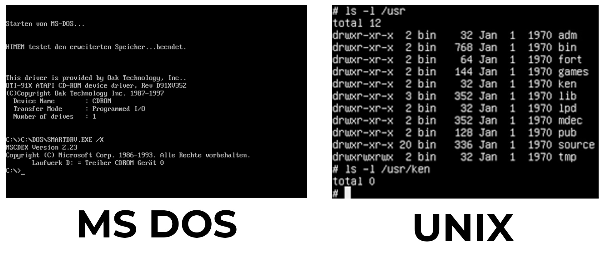
  <p align="center"> MS DOS vs UNIX </p>
</p>

A cette époque, pas vraiment d'interface graphique (faute de mémoire vive) mais les ordinateurs fonctionnaient de la même façon qu'aujourd'hui. Seul problème, vous l'avez peut-être remarqué, les deux principaux systèmes d'exploitation sont propriétaires et payants ce qui est plutôt contraignants quand on est féru d'informatique : payer une licence 200-300€ à chaque fois que l'on souhaite monter un ordinateur c'est plutôt contraignant et coûteux. De surcroît, la licence propriétaire empêche l'accès au code source de l'OS par les utilisateurs, freinant ainsi toutes les potentielles idées innovantes que peuvent proposer ces derniers pour améliorer l'OS. Cette mentalité où c'est la communauté des utilisateurs qui propose, améliore et entretient un logiciel se nomme la mentalité open source. En effet, quand vous avez accès au code source d'un logiciel, vous savez potentiellement tout sur ce dernier (encore faut-il les compétences et le temps, mais dans tous les cas, factuellement, tout est consultable par n'importe qui). En plus de faire des économies sur le coût de ces logiciels, ces derniers sont souvent très performants car rassemblant une intelligence collective inouïe et se basant sur un principe anarchique où il n'y a aucune hiérarchie (théoriquement) qui contrôle les modifications du code source.

C'est avec cette mentalité open source que deux projets vont voir le jour en même temps pour développer un nouveau système d'exploitation totalement gratuit et surtout libre. Un logiciel libre signifie que le code source est consultable et modifiable par les utilisateurs (open source en anglais) ce qui donne la possibilité de le modifier selon leur bon vouloir et même de le redistribuer pour en faire leur propre version et même de la "commercialiser" (même si cela est généralement considéré comme amorale par la communauté open source) :
- D'un côté le projet GNU de Richard Stallman, commencé en 1984, qui souhaitait créer un système d'exploitation gratuit et open source, basé sur Unix
- De l'autre un étudiant, Linus Torvald, de l'Université de Helsinki (Finlande), qui, en 1991, fatigué par les défauts de l'OS Unix qu'il ne peut modifier, entreprend de créer sur son temps libre son propre système d'exploitation basé aussi sur Unix : Linux (contraction de Linus et Unix). Le projet deviendra rapidement collaboratif avec toujours Linus comme chef d'orchestre (encore aujourd'hui).

<p align="center">
  
  <p align="center"> Les premiers collaborateurs du projet Linux </p>
  <p align="center"> Source : https://docs.huihoo.com/linux/kernel/a1/index.html </p>
</p>

Il s'avère que ces projets, se développant à peu près à la même époque, sont rapidement devenus complémentaires. D'un côté tandis que Richard Stallman créait les programmes de base d'un OS (programme de copie de fichier, de suppression de fichier, éditeur de texte), Linus s'était lancé dans la création du « cœur » d'un système d'exploitation : le noyau. Le projet GNU (programmes libres) et Linux (noyau d'OS) ont fusionné pour créer GNU/Linux. Une redoutable association qui est souvent résumé par le mot "Linux" mais techniquement le nom de ce système d'exploitation est "GNU/Linux".

Mais qu'est-ce qu'un noyau dans un système d'exploitation ? Vu que nous allons essentiellement parler du noyau Linux, tant le sujet de l'OS GNU/Linux est vaste, nous devons définir ce que représente un noyau dans un système d'exploitation. Grosso modo, un noyau d'OS (kernel en anglais) représente ce que nous expliquions en préface, la gestion brute de ressources matérielles. C'est, comme son nom l'indique de manière plutôt pertinente, le cœur du système d'exploitation. C'est le premier logiciel de l'OS qui est lancé au démarrage de ce dernier (Pour info, l'OS se lance en deuxième au démarrage de votre ordinateur, le premier étant le BIOS). Tous les autres logiciels du système d'exploitation se basent sur le cœur  de ce dernier. Il est donc important de comprendre que le cœur  d'un OS est un logiciel très critique et important, car c'est là que toutes les règles et l'architectures du système d'exploitation sont définies. Un kernel défaillant ou mal conçu conduira inexorablement à un mauvais OS. C'est donc pour cela, que nous allons uniquement nous concentrer sur cette technologie, car sans lui on ne peut pas expliquer ce qu'il y a autour.

<p align="center">
  
</p>

Vous l'avez peut-être déjà compris mais le fait que le projet GNU/LINUX est gratuit et libre constitue un avantage indéniable sur les autres systèmes d'exploitation de l'époque. De plus, comme on peut le redistribuer, de nombreuses entreprises se sont créées sur la redistribution et l'amélioration de ce projet et propose ce qu'on appelle des distributions. En effet, un système d'exploitation est en lui-seul peu utile, il nous faut des logiciels pour le rendre utile et qu'il travaille un peu : un environnement de bureau (Gnome, XFCE, ...), des services de messageries, des gestionnaire de fichiers (Nautilus,...), des terminaux de commandes (Konsole, ..), des gestionnaires de paquets (apt-get, pacman, ...), ... Généralement, le noyau Linux est le même pour toutes les distributions et c'est le reste qui est modulé selon les distributions. Il existe donc de multiples distributions et théoriquement une infinité vue que n'importe quelle installation avec un noyau linux est une distribution. On peut citer les plus connues comme Ubuntu, Debian, Mint, Arch, Kali, Mandriva, Red Hat, ...

<p align="center">
  
  <p align="center"> Source : https://informathieu.fr/linux-fait-tout-fonctionner </p>
</p>

Il serait complétement insensé de lister exhaustivement tous les avantages et défauts, des architectures, des codes des différentes distributions. Comme nous l'avons dit, nous allons uniquement nous concentrer sur le noyau Linux. Néanmoins le noyau Linux est intrinsèquement un projet qui évolue perpétuellement. Il est donc délicat de parler de son architecture et de son code comme quelque chose de définitif et figé dans le temps. Pour preuve, il suffit d'aller voir le projet Linux disponible sur GitHub (Linus Torvalds est entre autres l'un des créateurs du logiciel de gestions de version : Git)

<p align="center">
  
  <p align="center"> Source : https://github.com/torvalds/linux </p>
</p>

Comme vous pouvez le voir sur l'image ci-dessus, c'est l'un des projets les plus suivis et mis à jour de la plateforme GitHub (presque 1 million de commits ! Le nombre de contributeurs est indiqué par le symbole infini ∞ ! Des dizaines de milliers de fork et de stars , ...) c'est un projet absolument colossal. Voilà ce qu'est le kernel Linux aujourd'hui ! Et c'est ce qui en fait sa force : des milliers de développeurs bénévoles, tous spécialistes d'un ou plusieurs domaines, aident au développement du kernel. Si vous détecter une faille, rien de plus simple : soit cette faille est dans votre domaine d'expertise et vous pouvez la modifier vous-même et soumettre la solution à tous les utilisateurs via une pull request sur GitHub; ou mettre en exergue cette faille auprès de la communauté dans l'espoir que quelqu'un la corrige ou vous aide à la corriger (ce qui est très souvent le cas au vu de l'activité du repository de Linus). Un projet communautaire si gigantesque est ce qui explique principalement toute l'engouement autour des distributions GNU/Linux et est sa force principale.

Il suffit de regarder la vidéo ci-dessous, pour saisir toute la puissance d'un projet open-source communautaire comme celui-ci (cliquez sur l'image en appuyant sur Ctrl pour ouvrir la vidéo dans un nouvel onglet) :

[](https://youtu.be/P_02QGsHzEQ "Linux Kernel Development Visualization (git commit history - past 6 weeks - june 02 2012)")

Dernièrement, la mentalité open source, et donc de surcroît GNU/Linux, est devenu très populaire, en réponse entre autres, aux révélations d'Edward Snowden sur la surveillance de masse de l'internet mondial par les Etats-Unis via la N.S.A. La popularité d'internet entrainant inexorablement des excès, des contrôles et des lois plus strictes, des déboires politiques, ... l'open source est alors devenu un moyen de contrer cette paranoïa ambiante quant à la sécurité des données sur internet. Si tout est visible sur un logiciel, un programme, une application, ... alors quelqu'un remarquera forcément si ce dernier utilise nos données de façon malveillante. C'est cette confiance collective, sans autorité hiérarchique, (qui n'est pas sans rappeler les utopies anarchistes de certains philosophes) qui est à la base de la popularité croissante de logiciels/programmes comme GNU/Linux, Firefox, Libre Office, Tor, Gimp, les cryptos monnaies avec la block chain, ... . Il est important de comprendre ce contexte dans lequel nous vivons présentement, pour saisir toute la puissance de GNU/Linux et plus précisément ici, du noyau Linux.

## Commençons 

Mais par où commencer, sous quel angle attaquer ce projet conséquent qui est mis à jour et améliorer presque tous les jours par des milliers de contributeurs à travers le monde ? Et bien en analysant l'essentiel de ce projet, sa racine, son tronc, son architecture. Nous allons nous attarder sur ce qui fait que Linux est si "facilement" modifiable, améliorable et maintenable et pourquoi il a la popularité qu'il détient aujourd'hui.

Malheureusement (ou heureusement), le noyau Linux n'est pas orienté objet : exit donc le diagramme UML de classe pour nous aider à comprendre comment il est construit. Nous ne pourrons donc pas utiliser le langage UML pour décrire ce projet mais on peut toujours essayer de le schématiser. Cependant schématiser un si gros projet, reviendrait à le comprendre entièrement et effectuer un travail conséquent pour réduire son explication en quelques pages. Or il existe déjà des livres qui tentent dans le faire de manière plus ou moins concise (Pour information, le livre ci-dessous fait presque 1000 pages) :

<p align="center">
  
  <p align="center"> Source : https://www.amazon.com/Understanding-Linux-Kernel-Process-Management-ebook-dp-B0043D2E54/dp/B0043D2E54/ref=mt_kindle?_encoding=UTF8&me=&qid= </p>
</p>

Tout ce qui a été dit précédemment ne sers qu'à souligner le fait que nous allons forcément faire d'énormes raccourcis dans l'explication de l'architecture et du code du noyau Linux. Nous se serons absolument pas exhaustif et très peu précis dans nos explications. Si vous souhaitez en apprendre plus sur le noyau Linux, il existe de multiples livres (payants bien sûr) qui feront de vous des experts du système d'exploitation, mais évidemment cela s'adresse aux personnes professionnelles du domaine ou très passionnées par le sujet, à vous de voir.

Maintenant que le sujet est enfin défini, nous pouvons enfin rentrer dans le vif du sujet : l'architecture du kernel Linux

## Architecture du noyau Linux

Le noyau Linux est un noyau de système d'exploitation assez unique dans sa conception. En effet, il est important de savoir qu'il existe deux types de noyau :
- les micro kernels : le noyau est composé d'un fichier central très sommaire, toutes les autres fonctionnalités sont implémentées dans des modules séparés. La communication entre les différents modules et le fichier central se fait via des fonctions définies. Cela permet notamment une excellente scalabilité, une lecture et un entretien du code simplifié. Cette méthode s'apparente énormément aux micro services dont la popularité augmente dû aux problèmes de Big Data.
- les kernels monolithiques : c'est la méthode traditionnelle pour créer un kernel. Tout le code dans un gros fichiers avec très peu de dépendance mais une scalabilité complexe et une résistance au panne faible.

Le noyau de Linux, lui est ... monolithique. Cela peut paraître très étrange au vu des louanges sur le côté communautaire de Linux que nous avons décrit précédemment, mais en effet, le noyau de Linux est essentiellement un gros fichier avec plein de code dedans. Mais pourquoi cela ? Il faut savoir que pour des raisons plus ou moins complexes, les micros kernels étaient (et sont toujours selon certains spécialistes) beaucoup moins performants que les kernels monolithiques. Linus Torvalds, lui, ne croyaient absolument pas à la puissance des micros kernels (ce qui lui valut des discussions houleuses avec certains collaborateurs de son projet) et à tout simplement choisi un noyau de type monolithique. Ce choix technique fut l'objet d'un débat houleux entre Linus Torvalds et Andrew S. Tanenbaum, professeur à l’université libre d’Amsterdam.

Mais alors comment expliquer la grande scalabilité et communauté de Linux si ce noyau est un gros fichier monolithique et complexe ? Premièrement, il est important de souligner qu'un kernel monolithique n'a jamais été problématique en soit. C'est une manière de coder extrêmement classique et maîtriser par le plus grand nombre. Ce qui pose problème ici, c'est d'expliquer sa maintenance et son entretien qui ferait pâlir les technologies Big Data d'aujourd'hui alors que ce kernel est censé être monolithique.

Pour contourner ce problème, les modules ont été créées. En effet, les modules sont des bouts de codes que l'on peut ajouter ou enlever du kernel avant ou pendant son exécution. Cela permet d'ajouter des fonctionnalités qui ne sont pas présente de base sur le kernel Linux et ainsi de contourner le gros désavantage des systèmes monolithiques : la scalabilité et la maintenance. Ce n'est pas exactement un micro kernel puisque le noyau en lui-même ne se repose pas sur les modules pour fonctionner. On peut voir les modules du noyau Linux comme des features additionnelles flexibles et performantes. Ainsi, si une nouvelle technologie apparaît (prenons comme exemple USB3) alors il "suffit" de créer un nouveau module et de le charger pour prendre cette nouvelle technologie en compte sur le système d'exploitation. Le kernel reste presque le même mais quand il rencontre un nouveau hardware, une nouvelle technologie, ... pas besoin de changer tout son code pour la prendre en compte, il suffit théoriquement de charger un nouveau module pour la prendre en compte. C'est en cela que réside la puissance de Linux, une énorme quantité de modules qui répondent à différentes situations spécifiques.

On peut facilement se rendre compte du nombre de modules dans le kernel Linux. Il suffit de lancer un ordinateur sous Linux et se rendre dans le fichier "/lib/modules". On peut voir le nombre de modules différents qui existent. Ce sont essentiellement des drivers pour différentes technologies et matérielles informatiques. Avec autant de modules permettant l'intégration de différentes technologies, on comprend mieux pourquoi Linux est si flexible et si développé à travers le monde. Si on regarde on obtient les résultats suivants :

<p align="center">
  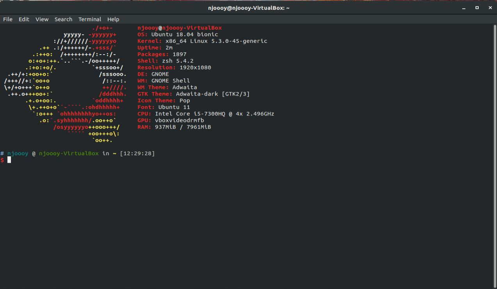
  <p align="center"> </p>
</p>

<p align="center">
  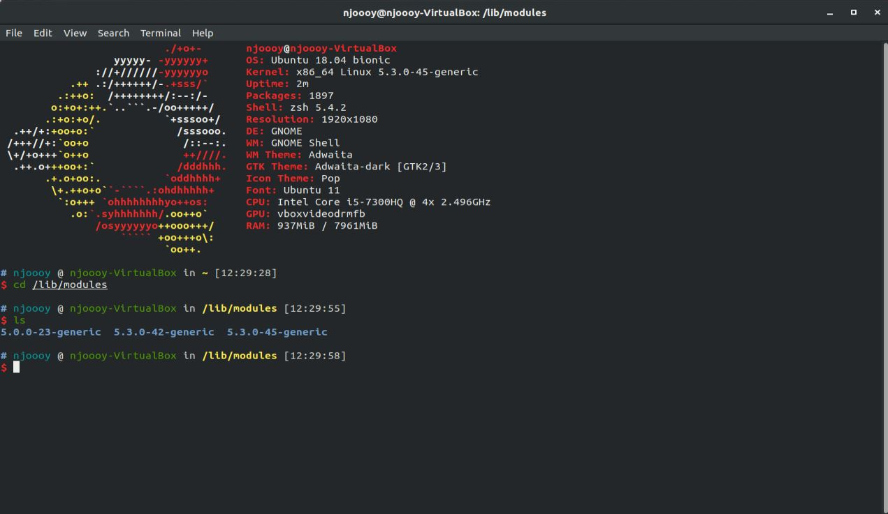
  <p align="center"> </p>
</p>

<p align="center">
  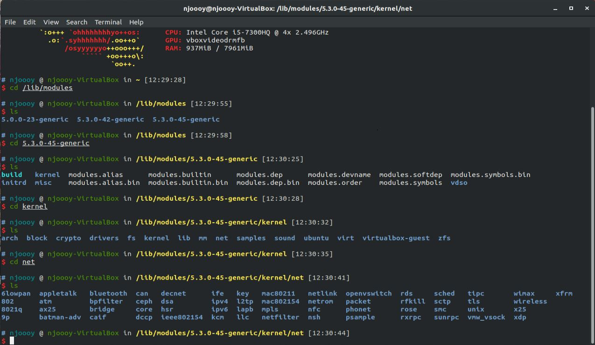
  <p align="center"> </p>
</p>

<p align="center">
  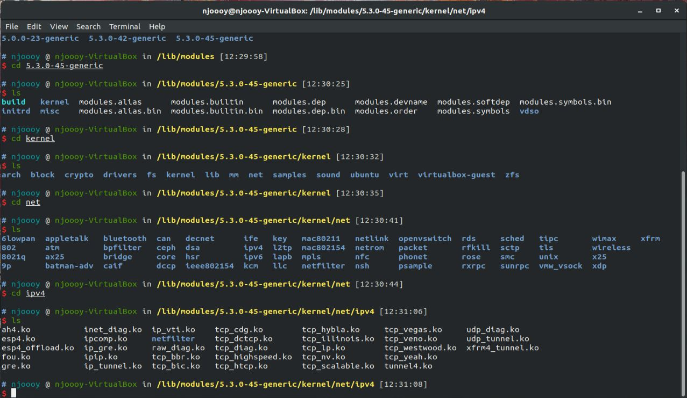
  <p align="center"> </p>
</p>

C'est pourquoi il y a tant de distribution différente de Linux. Outre le fait de changer ce qui entoure le kernel Linux et les logiciels qu'on va préinstaller dans une distribution, ce qui fait leur différence, c'est aussi les différents modules que l'on va charger avec le kernel Linux. Si on regarde plus activement le Makefile (fichier permettant de compiler du code en C) on voit déjà qu'il est extrêmement  complexe mais que surtout on peut totalement choisir comment compiler le noyau et c'est ce qui fait que de multiples distributions ont vu le jour, chacun pour répondre ou correspondre à une philosophie ou une situation spécifique. D'un cœur  de système d'exploitation monolithique, Linux a donc su innover en introduisant la notion de module chargeable et versatile pour se rendre extrêmement  adaptable aux différents référentiels dans laquelle il pouvait intervenir.

<p align="center">
  
  <p align="center"> Presque 2000 lignes, plus de 270 collaborateurs sur le Makefile du kernel Linux. Tant de façon de compiler le cœur  de GNU/Linux est l'une des raisons de sa grande diversité </p>
  <p align="center"> Source : https://github.com/torvalds/linux </p>
</p>

Linux est donc devenu si communautaire et flexible car il fut l'un des premiers kernel open source permettant de se diversifier aussi facilement. C'est pourquoi on retrouve le noyau Linux dans énormément de device de nos jours : dans les smartphones (Androïd), dans les systèmes embarqués, dans de nombreux serveurs à travers le monde, dans nos ordinateurs. La base du kernel est gratuit et libre, il ne tient donc qu'à vous et vos envies de le faire correspondre à vos attentes si jamais quelqu'un ne l'a pas déjà fait.

Le noyau Linux a donc pour but de faire fonctionner l'OS GNU/Linux et rendre l'utilisation des ressources matérielles transparente pour les utilisateurs. L'utilisateur ne doit presque jamais se rendre compte des limitations matérielles comme le processeur par exemple. Chaque processus a toujours l'impression d'être seul et d'avoir accès à toutes les ressources de calcul et de mémoire. C'est sans compter l'exceptionnelle gestion du noyau. En effet, la réalité est extrêment plus complexe. Par exemple, chaque processus a l'impression d'être unique, c'est surtout car le kernel s'assure que les différents processus alternent successivement l'utilisation des ressources matérielles. Voilà, ce qu'est la puissance d'un noyau d'OS.

Le noyau Linux peut être résumé en 5 sous systèmes :
- Le Process scheduler (Le planificateur des processus) : <br>
Comme son nom l'indique, cette partie du noyau gère et contrôle les processus ayant accès au CPU. Il s'assure que l'accès au processeur soit réparti entre les différents processus et équitable, et que les demandes des ressources matérielles soient effectuées dans les temps.
- Le Memory Manager (Le gestionnaire de mémoire) : <br>
Cette partie se charge de la répartition de la mémoire principale du système. Elle se charge de ce que l'on nomme la mémoire virtuelle, une mémoire qui permet au noyau Linux de supporter plus de processus que disponible physiquement (la fameuse différence entre les ordinateurs 32bits et 64bits correspondent à la taille de la mémoire virtuelle de votre ordinateur). Le memory manager permet aussi entre autres de faire des swaps de mémoire entre la RAM et les périphériques de stockage. 
- Le Virtual File System (Le système de fichier virtuel) : <br>
Cette partie se charge de présenter un système de fichier fonctionnel pour tous les types de fichiers. Cela permet de supporter un grand nombre de format de fichiers compatible avec différents OS.
- Le network interface (L'interface réseau) : <br>
C'est la partie qui se charge de tous les protocoles et requêtes réseau (TCP/IP, ARP, Ethernet, ...), très importants si l'on souhaite pouvoir communiquer avec d'autres ordinateurs.
- L'inter process communication (La communication inter processus) : <br>
Comme son nom l'indique, cette partie est dédié à la communication entre les différents processus. C'est une partie importante car elle permet à des processus qui, théoriquement, ne sont pas spécialement conçus pour communiquer ensemble, de partager des informations et de travailler ensemble.

(Le noyau étant codé en anglais il n'existe pas de nom officiel français pour ces parties, juste des traductions littérales. Il convient aussi de rappeler encore une fois que c'est un résumé très grossier de la complexité du code du noyau Linux, si vous souhaitez comprendre plus profondément le fonctionnement du noyau, nous vous invitons à lire des articles ou des livres de professionnels beaucoup plus complet)

Vous reconnaissez certainement beaucoup de points communs avec les fonctionnalités du kernel décrites dans les parties précédentes comme la gestion de mémoire, la communication entre différents processus, gestion de l'exécution des processus, ...
Ces 5 sous-systèmes du noyau Linux sont dépendantes les unes des autres et cette interdépendance peut être résumée avec le schéma ci-dessous :

<p align="center">
  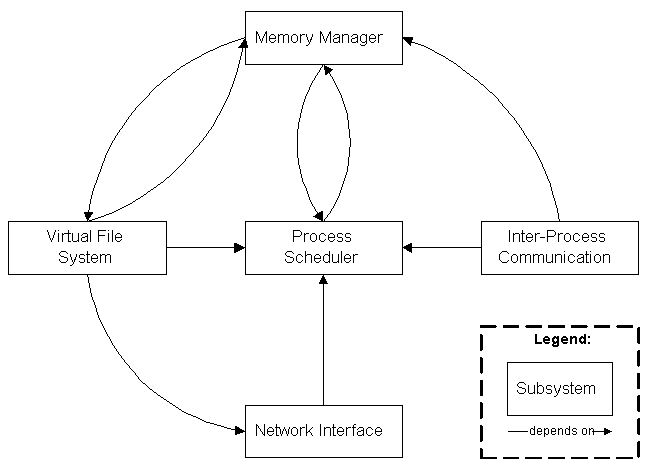
  <p align="center"> Architecture des sous sytèmes du noyau Linux </p>
  <p align="center"> Source : https://docs.huihoo.com/linux/kernel/a1/index.html </p>
</p>

On remarque le process scheduler est au cœur  de l'architecture du noyau, logique car c'est lui qui gère l'accès au CPU. N'oubliez pas qu'un ordinateur est plutôt bête, il effectue de simples calculs à une vitesse effarante. Donc pour n'importe quelle tâche que votre ordinateur réalise, il doit passer par un composant de calcul via le process scheduler et doit pouvoir être interrompu et repris pour une répartition équitable des ressources.
En revanche, le process scheduler utilise le memory manager pour accéder à un processus en pause lorsqu'on veut le relancer.
L'inter-process communication dépend du memory manager pour supporter des mécanismes de mémoire partagés ce qui permet à plusieurs processus d'accéder à une mémoire commune et donc de communiquer entre eux plus facilement.
Le Virtual File System utilise le Network Interface pour supporter ce qu'on nomme le Network File System (NFS)
Le Memory Manager utilise le virtual file system afin de supporter le swapping (c'est aussi la seule raison pour laquelle le memory manager dépend du process scheduler).

## Commandes relatives aux modules

La commande linux qui permet d’obtenir la liste des modules chargés est “lsmod”. Cette commande liste aussi la mémoire utilisé par le module résident en bytes “Size” et le nombre d’instance utilisés “Used by” , si le nombre est 0 le module n’est pas utilisé actuellement.
Le nom après le nombre représente les informations de ce qu’utilise le module. 

```bash
lsmod
```

<p align="center">
  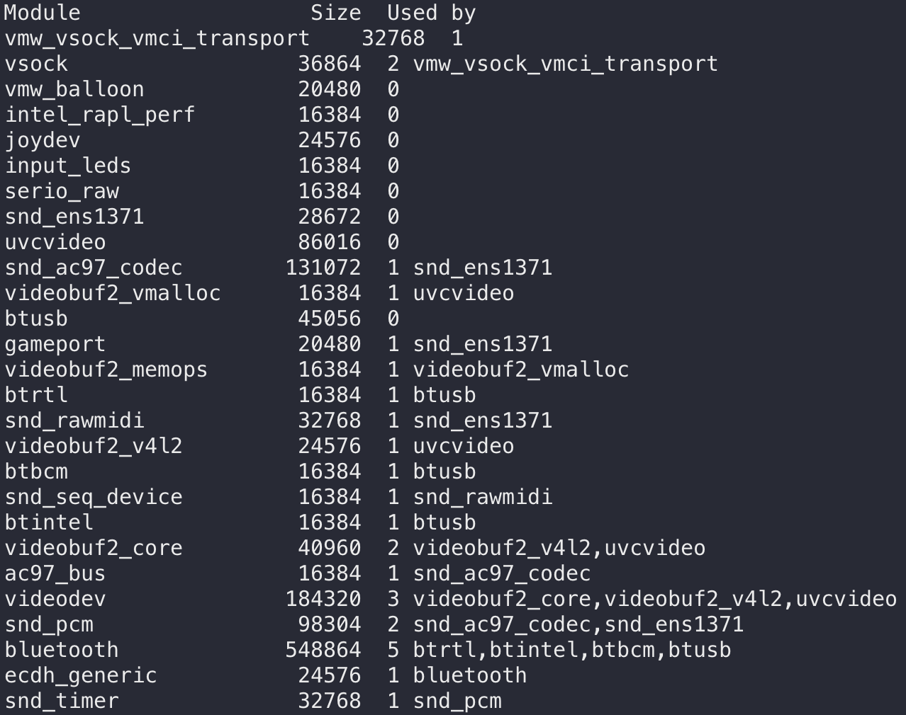
  <p align="center"> </p>
</p>

La commande modinfo permet de montrer des informations sur le module 

```bash
modinfo vsock
```
<p align="center">
  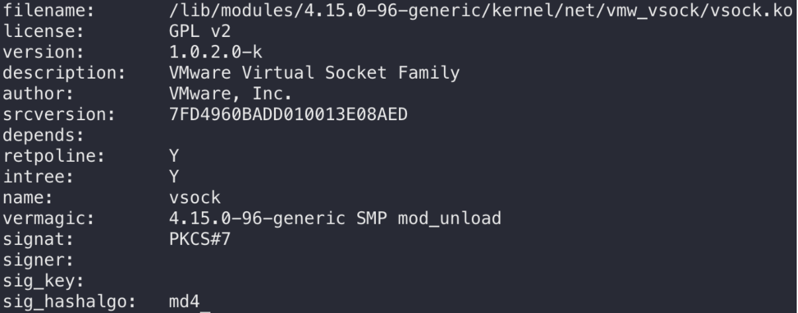
  <p align="center"> </p>
</p>

## Analyse du code

Nous avons réalisé l’analyse du code de Linux avec trois différents outils, CodeScene, cppcheck et CPD.   

### CodeScene 

Le premier outil d’analyse de code est CodeScene, il fournit une visualisation du code basé sur les données de contrôle de version et des algorithmes d’apprentissage automatique qui identifient les risques cachés dans le code.

CodeScene détecte les “hotspots” qui sont les zones sensibles, codes utilisés fréquemment, là où l’optimisation est plus susceptible d’obtenir un retour sur investissement.

On apprend également avec cet outil que le code de Linux est composé à 96% de C, que le projet fait environ 20 millions de ligne de code et est soutenu par environ 1300 contributeurs actifs.

Voici les résultats de l'analyse de code :

- 3 fichiers avec une qualité du code en déclin 
<p align="center">
  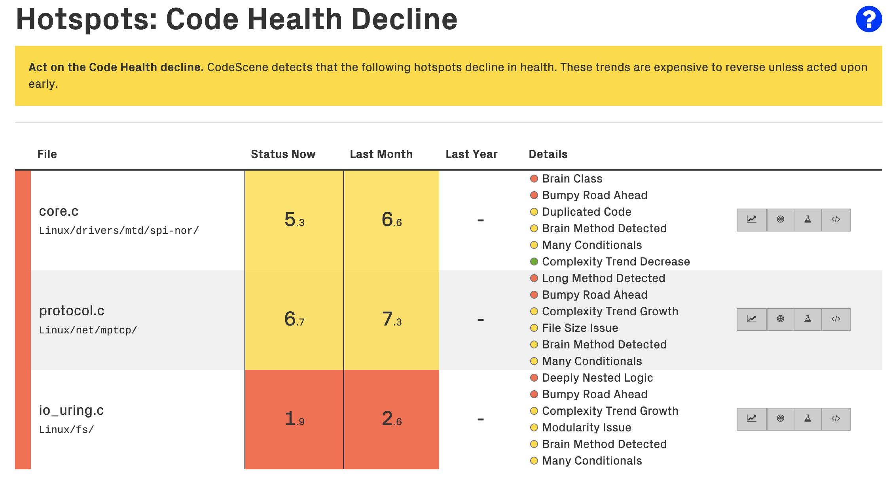
  <p align="center"> </p>
</p>

- 15 Avertissement sur la complexité du code dans ces fichiers
<p align="center">
  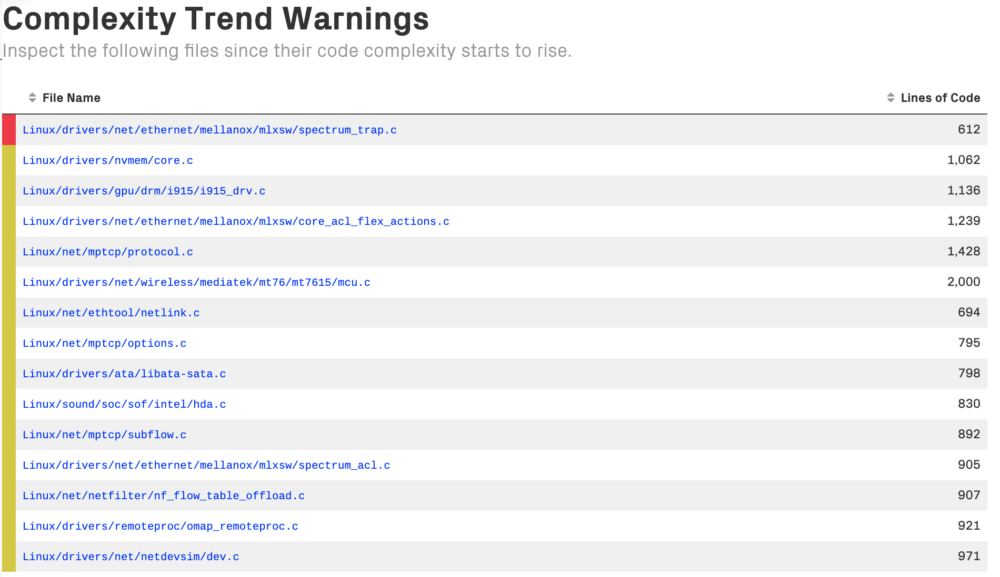
  <p align="center"> </p>
</p>

- Une prédiction de CodeScene sur 3 fichiers qui risque une baisse de qualité du code et donc 
<p align="center">
  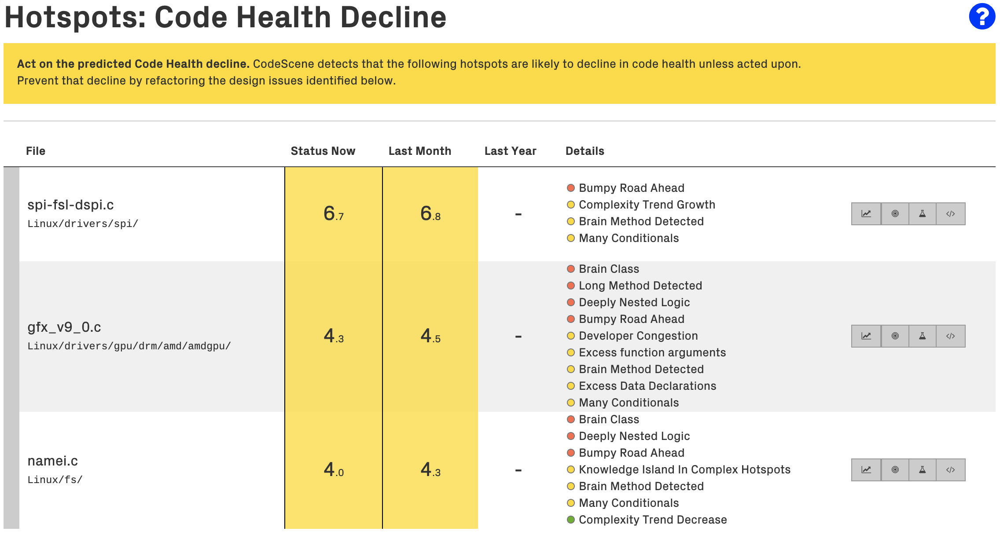
  <p align="center"> </p>
</p>

Le nombre de fichiers considérés comme des “hotspots” est assez faible par rapport au nombre total de fichiers qui composent Linux. On peut imaginer que l’optimisation sera réalisée au vu de la communauté active dont bénéficie Linux.

### Cppcheck

Ensuite nous avons utilisés cppcheck, outil en ligne de commande qui va permettre de détecter une multitudes de différents types de bugs dans le code comme :

- Undefined behaviour
- Dead pointers
- Division by zero
- Integer overflows
- Invalid bit shift operands
- Invalid conversions
- Invalid usage of STL
- Memory management
- Null pointer dereferences
- Out of bounds checking
- Uninitialized variables
- Writing const data

Vous trouverez le fichier de résultat de l'analyse [ici](./cppcheck.txt).

### CPD

Le dernier outil d'analyse utilisée est CPD, il permet de trouver les duplications de codes. En effet cette analyse est importante car la duplication de code peut être potentiellement grave et affecter la maintenabilité du système.

Avec cet outil impossible d'analyser tout le projet, cela requiert beaucoup trop de ressources et/ou de temps. L'analyse est donc effectuée pour les fichiers présent dans kernel (463 fichiers).

Vous trouverez le fichier de résultat de l'analyse [ici](./cpd_report_kernel.txt).

On trouve quelques duplications de code mais il s'agit principalement de boucles.

### Conclusion de l'analyse

Linux est un OS avec une bonne qualité de code grâce à sa communauté active...

## Sources 
- Professional Linux Kernel Architecture | Wolfgang Mauerer | 2008 : <br>
https://cse.yeditepe.edu.tr/~kserdaroglu/spring2014/cse331/termproject/BOOKS/ProfessionalLinuxKernelArchitecture-WolfgangMauerer.pdf
- Anatomy of the Linux kernel | History and architectural decomposition : <br>
https://developer.ibm.com/technologies/linux/articles/l-linux-kernel/
- Conceptual Architecture of the Linux Kernel | Ivan Bowman | January 1998 : <br>
https://docs.huihoo.com/linux/kernel/a1/index.html
- La mémoire virtuelle : <br>
https://sites.uclouvain.be/SystInfo/notes/Theorie/html/MemoireVirtuelle/vmem.html
- GNU : https://www.gnu.org/home.fr.html
- Wikipedia : https://en.wikipedia.org/wiki/Linux_kernel
- Linus Torvalds' GitHub profile : https://github.com/torvalds
- CodeScene https://codescene.io
- CppCheck http://cppcheck.sourceforge.net
- CPD https://pmd.github.io/latest/index.html
